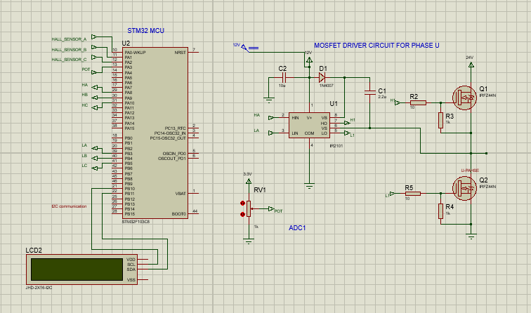

#  ⭐Speed Control of BLDC Motor using 6-Step Method

## 📁Overview
This project implements speed control of a Brushless DC (BLDC) motor using an STM32 microcontroller with the **6-step (trapezoidal) commutation method**. 
Hall-effect sensors provide rotor position feedback, and PWM signals control the MOSFET inverter for precise motor control.

## ⚒️Hardware Requirements
- STM32F103C8T6
- 3-phase BLDC motor(24V BLDC 4 pole motor max RPM-3000)
- MOSFET-based inverter or gate driver
- Power supply as per motor specification
-  potentiometer for speed reference
-  16×2 LCD with I²C module (PCF8574/PCF8574A)

## 💠Schematic diagram

## 💠Pin Configuration
| STM32 Pin | Function           |
|-----------|------------------|
| PA0       | Hall Sensor A     |
| PA1       | Hall Sensor B     |
| PA2       | Hall Sensor C     |
| PA8       | High side A       |
| PA9       | High side B       |
| PB10      | High side C       |
| PB3       | Low side A        |
| PB4       | Low side B        |
| PB5       | Low  side C       |
| PA3       | ADC1 ch3(POT)     |
| PB10      | I²C SCL           |
| PB11      | I²C SDA           |

## 💠How the Project Works

The project controls the speed of a BLDC motor using the **6-step (trapezoidal) commutation method** based on Hall-effect sensor feedback.

1. **Rotor Position Detection**  
   Three Hall-effect sensors mounted inside the motor generate digital signals corresponding to rotor position.  
   Each unique Hall combination represents one of the six electrical sectors (60° each).

2. **Hall Interrupt Handling**  
   Hall sensor signals are connected to external interrupt pins of the STM32.  
   Interrupts are configured on rising and falling edges to ensure accurate and timely commutation.

3. **6-Step Commutation Logic**  
   On every Hall interrupt:
   - The current Hall state is read.
   - A predefined commutation table selects the active phase pair.
   - One phase is driven high using PWM, one phase is driven low, and the third phase is left floating.

4. **PWM-Based Speed Control**  
   PWM duty cycle controls the average phase voltage.  
   Increasing duty cycle increases motor speed, while decreasing duty cycle reduces speed.

5. **Speed Measurement**  
   Motor speed is calculated using the time interval between consecutive Hall transitions.  
   This provides real-time speed feedback for closed-loop control.

6. **PID Speed Controller**  
   - The reference speed is set using a potentiometer (ADC input).
   - The measured speed is compared with the reference speed.
   - A PID controller adjusts the PWM duty cycle to minimize speed error.

7.**LCD Display (Speed Monitoring)**
   A 16×2 I²C LCD is used to display motor speed information in real time:
   - Line 1: Current motor speed (RPM)
   - Line 2: Target/reference speed (RPM)

8. **Continuous Operation**  
   The system continuously:
   - Reads Hall sensors
   - Performs commutation
   - Measures speed
   - Updates PWM via PID control  
   - ensuring stable and smooth motor operation.

##  💠Note
- For identifing hall reading for each sector , power any tw0 phase directly with 30% rated voltage , let rortor settle for two sencods , and take hall sensor reading, repeated this procces for othe phase combinations too.
- refer ti refernece
- refer BLDC 6 step commutation pdf
- refer lcd datasheet

